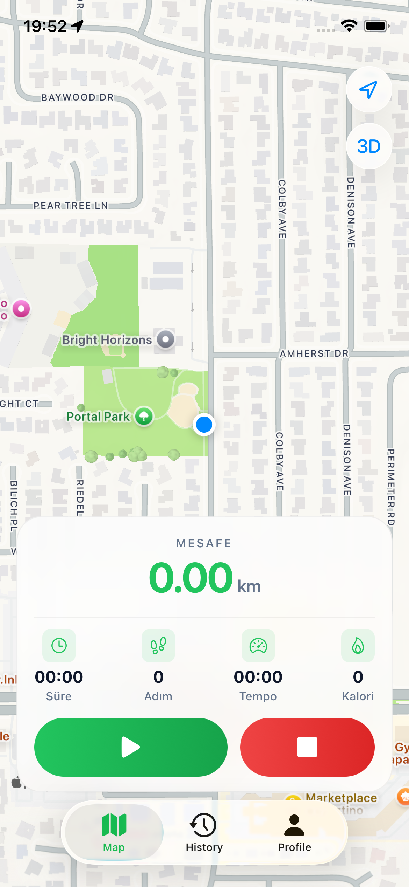
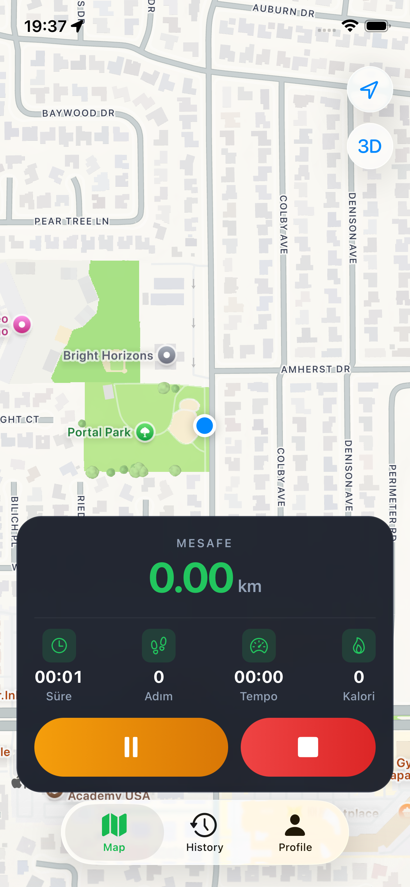
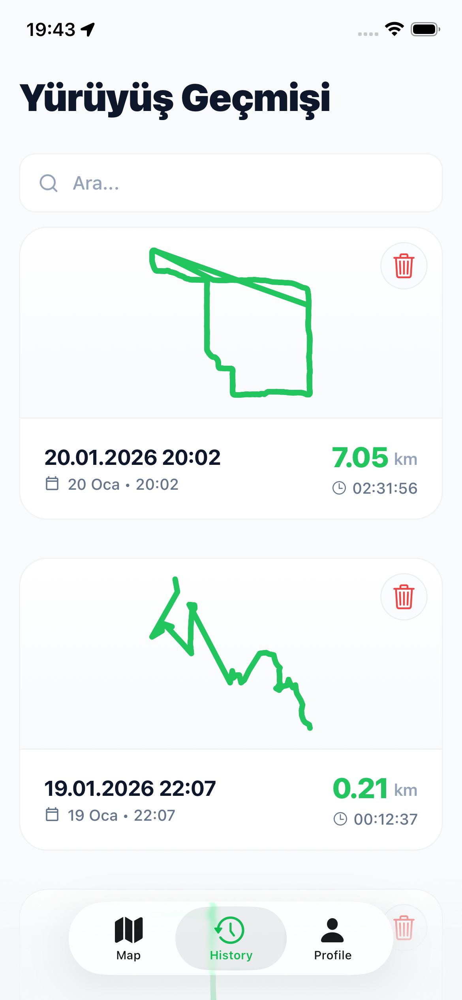
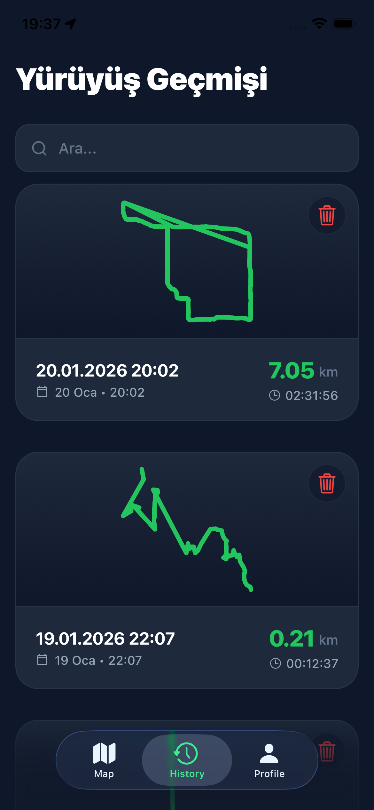
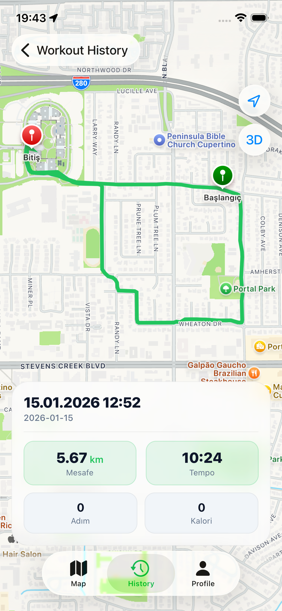
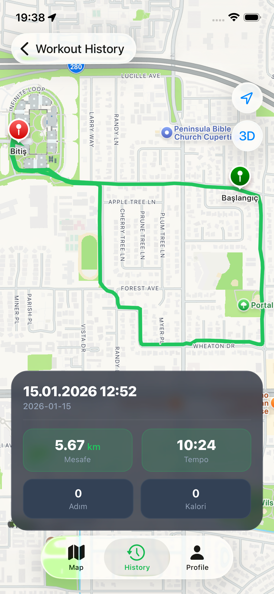
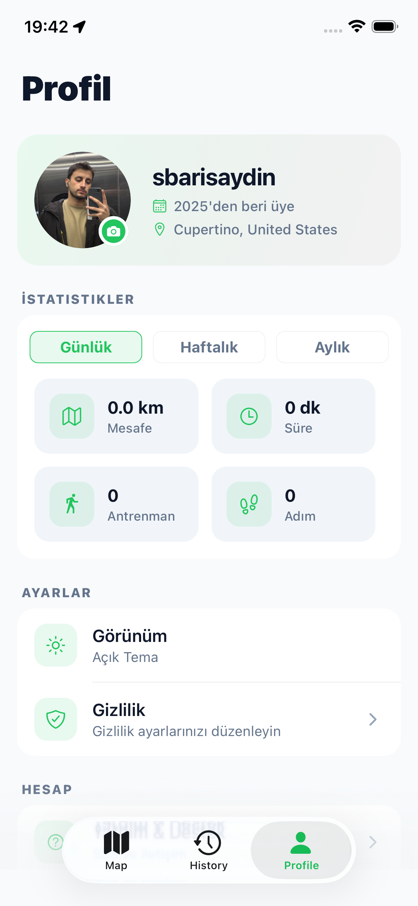
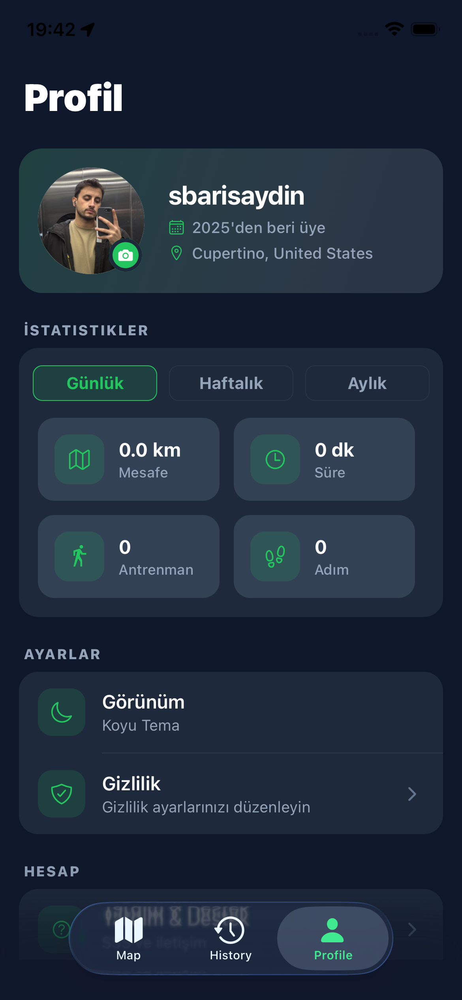

# 🗺️ Map Lover - Technical Portfolio

> [!IMPORTANT]
> **LEGAL NOTICE**: This repository is public for portfolio review purposes. All rights are reserved by the author. Use of this code for commercial purposes, redistribution, or derivative works is strictly prohibited. See [LICENSE](./LICENSE) for details.

## 🚀 Overview
Map Lover is a sophisticated, full-stack mobile application designed for tracking and managing outdoor activities. Built with **React Native** and **Expo**, it demonstrates advanced state management, real-time location tracking, and a premium UI/UX experience.

### 🌟 Key Technical Achievements
- **Advanced State Management**: Orchestrated complex global states using **Zustand**, ensuring seamless synchronization between location tracking and UI updates.
- **Real-time Geo-logic**: Implemented precise location tracking and polyline rendering for workout routes.
- **Dynamic Theming Engine**: Developed a custom theme provider with support for system-based and manual Light/Dark mode switching.
- **Performance Optimization**: Optimized map rendering and list updates to maintain a constant 60 FPS on both iOS and Android.

---

## 🏗️ Technical Architecture

### Core Stack
- **Framework**: Expo / React Native (managed workflow)
- **Language**: TypeScript & JavaScript
- **Backend-as-a-Service**: Supabase (Auth, Database, Storage)
- **Navigation**: Expo Router (File-based routing)

### Directory Structure
- `app/`: Modern file-based routing architecture.
- `components/`: Atomic design principles applied to UI components.
- `providers/`: Context-driven architecture for Global Themes and Authentication.
- `services/`: Encapsulated logic for external APIs and Supabase interactions.
- `store/`: Centralized business logic using Zustand stores.

---

## 🛠️ Core Challenges & Solutions

### 1. Persistent Theme System
Implemented an `AsyncStorage` backed theme provider that respects system preferences while allowing user overrides. This involves complex context-aware styling throughout the component tree.

### 2. Scalable Authentication
Integrated Supabase Auth with custom user profile management, ensuring secure data access and account management (including full account deletion via database RPC).

### 3. Map Performance
Handled large polyline datasets by implementing path simplification algorithms (e.g., Douglas-Peucker) to ensure map fluidity without compromising route accuracy.

---

## 📱 Visual Showcase

### Map Tracking & History
| Light Mode | Dark Mode |
| :---: | :---: |
|  |  |
|  |  |

### Route Details & Profile
| Light Mode | Dark Mode |
| :---: | :---: |
|  |  |
|  |  |

---

## 👨‍💻 Developed By
**Serhat Barış Aydin**
- [GitHub Profile](https://github.com/js-lover)
- [LinkedIn Profile](https://linkedin.com/in/js-lover)

---

⭐ Developed with passion for modern mobile architectures.
